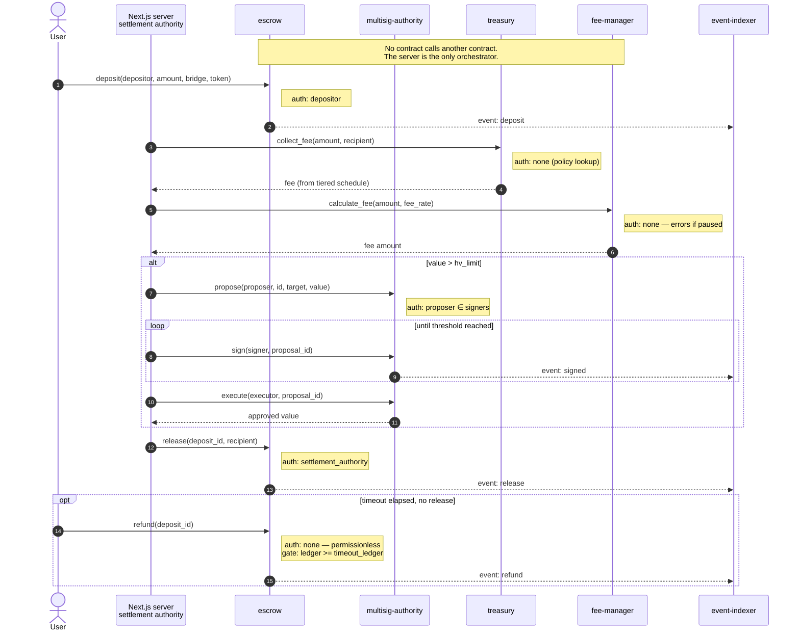
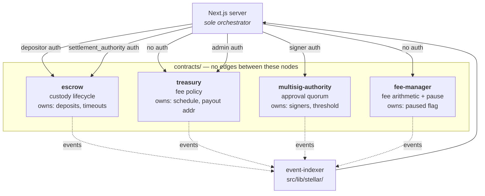

# ADR-012: Soroban Contract Architecture — Separation of Concerns

**Status:** Accepted
**Date:** 2026-07-24
**Deciders:** Stellar-Spend core team

---

## Context

`contracts/` holds four Soroban contracts — `escrow`, `treasury`, `multisig-authority`, and `fee-manager`. Their responsibilities overlap enough that a contributor reading the tree cold could reasonably conclude that two of them should be merged, or that a new feature belongs in whichever contract they happened to open first.

Three specific ambiguities motivated this ADR:

1. **`treasury` and `fee-manager` both compute fees.** `treasury::collect_fee` derives a rate from an on-chain tiered schedule; `fee-manager::calculate_fee` applies a caller-supplied rate. Without a recorded boundary, the obvious "cleanup" is to delete one.
2. **`multisig-authority` is mirrored off-chain.** `src/lib/multisig-settlement.ts` implements the same M-of-N proposal/sign/execute state machine in TypeScript. Which one is authoritative is not obvious from either file.
3. **No contract calls any other contract.** There are no `Client` invocations or `invoke_contract` calls anywhere in `contracts/`. A reader may assume the wiring exists and is simply hard to find, and then design a feature around a call path that does not exist.

This ADR records the intended boundaries, the actual (as-built) call flow, and the upgrade strategy — so that future work either follows the boundary or changes it deliberately.

Related prior decisions: [ADR-008](./ADR-008-soroban-escrow-trust-model.md) records *why* escrow uses a time-locked dual-authority trust model. This ADR records *where each responsibility lives*; it does not restate the trust model.

---

## Decision

### 1. One contract, one responsibility

Each contract owns exactly one concern, and that concern is defined by **what state it is the source of truth for** — not by which flow calls it.

| Contract | Sole responsibility | Authoritative state | Must NOT own |
|---|---|---|---|
| `escrow` | Custody lifecycle of a single user deposit | `deposits: Map<String, EscrowDeposit>`, per-deposit `timeout_ledger` | Fee rates, signer sets, treasury addresses |
| `treasury` | Fee **policy** — the tiered schedule and the payout destination | `fee_schedule: Map<i128, u32>`, `treasury` address, `admin` | Custody of funds, signature collection |
| `multisig-authority` | Authorisation **quorum** — who may approve a high-value action | `signers`, `threshold`, `hv_limit`, `proposals` | Fee math, deposit state |
| `fee-manager` | Stateless fee **arithmetic** + the operational pause switch | `paused`, `admin`, `VERSION` | Fee policy (rates come from the caller) |

The `treasury` / `fee-manager` split is the one most at risk of being collapsed, so state it plainly:

> **`treasury` decides *what* the rate is. `fee-manager` computes *the number* given a rate.**

`treasury::get_fee_for_amount` is a policy lookup against the tiered schedule. `fee-manager::calculate_fee(amount, fee_rate)` takes the rate as an argument and is deliberately ignorant of tiers. Keeping them apart means the pause switch and the arithmetic can be upgraded without touching the fee schedule (and therefore without an admin re-signing the schedule), and the schedule can be re-tiered without redeploying the arithmetic.

**They are not redundant. Do not merge them.**

### 2. Authorisation model per entry point

Every state-mutating entry point declares its own auth. There is no shared auth contract and no ambient admin.

| Contract | Function | `require_auth()` on | Additional gate |
|---|---|---|---|
| `escrow` | `init` | `settlement_authority` | — |
| `escrow` | `deposit` | `depositor` | `amount > 0` |
| `escrow` | `release` | stored `settlement_authority` | not already released/refunded |
| `escrow` | `refund` | **none** — permissionless | `current_ledger >= timeout_ledger`, not released/refunded |
| `escrow` | `set_timeout` | stored `settlement_authority` | `0 < timeout <= 10_000_000` |
| `treasury` | `init` | `admin` | — |
| `treasury` | `set_fee_schedule` | stored `admin` | `basis_points <= MAX_SINGLE_FEE_BP` (500) |
| `treasury` | `update_treasury` | stored `admin` | — |
| `treasury` | `collect_fee` / `route_to_treasury` | **none** — view/event only | `amount > 0` |
| `multisig-authority` | `propose` / `sign` / `execute` | caller, **and** caller ∈ `signers` | quorum via `required_threshold(value)` |
| `multisig-authority` | `add_signer` / `remove_signer` / `set_threshold` | `admin`, **and** caller == stored `admin` | removal must not make quorum impossible |
| `fee-manager` | `pause` / `unpause` / `migrate` | stored `admin` | — |
| `fee-manager` | `calculate_fee` | **none** | fails when paused |

Two entries deserve emphasis because they are easy to "tighten" by accident:

- **`escrow::refund` is intentionally permissionless.** It is the user's guaranteed exit path when the server is unavailable ([ADR-008](./ADR-008-soroban-escrow-trust-model.md)). Its only gate is the timeout. Adding `require_auth()` here would remove that guarantee. Note that the *funds destination* is the recorded `depositor`, so the missing auth does not let a caller redirect funds — it only lets anyone trigger the refund on the depositor's behalf.
- **`multisig-authority::required_threshold` returns 1 for values at or below `hv_limit`.** This is a deliberate low-value fast path, not a bug. Setting `hv_limit = 0` disables it and requires the full threshold for every value.

### 3. Cross-contract call flow

**As built, there are zero on-chain cross-contract calls.** Each contract is an independent unit; sequencing between them happens off-chain in the Next.js server. Contracts communicate outward only by emitting events, which `src/lib/stellar/event-indexer.ts` consumes.

Responsibility boundaries, with the direction of every permitted dependency:

Two consequences follow, and both are load-bearing:

- **Adding an on-chain call between two of these contracts is an architectural change, not a refactor.** It couples their upgrade cycles and their auth contexts (`require_auth` in a cross-contract call authorises the *invoking contract*, not the original user). Such a change needs a new ADR superseding this one.
- **Atomicity is off-chain.** Because fee calculation, quorum, and release are separate transactions, a failure between them leaves partial state. The escrow timeout is the backstop: an un-released deposit becomes refundable. Any new multi-step flow must have a comparable backstop.

### 4. On-chain vs off-chain multisig

`multisig-authority` (Rust) and `src/lib/multisig-settlement.ts` (TypeScript) implement the same state machine. This duplication is deliberate and the roles are not symmetric:

- **`multisig-authority` is authoritative for on-chain enforcement.** Quorum that must be enforced trustlessly belongs here.
- **`src/lib/multisig-settlement.ts` is a coordination and audit layer.** It gathers signatures, persists them to Postgres for the audit log, and drives the on-chain calls. It cannot be trusted to enforce quorum on its own.

**Any change to threshold semantics must be applied to both, on-chain first.** If they disagree, the contract wins.

### 5. Escrow does not move tokens

`escrow::deposit` accepts a `token: Address` argument and `escrow::release` accepts a `recipient`, but neither performs a token transfer — `release` marks state and emits an event. Custody state and the actual asset movement are therefore tracked in different places today.

This is recorded here as a known and deliberate limitation of the current implementation, not an oversight to be silently "fixed" mid-refactor. Wiring `token::Client` transfers into the contract changes the trust model described in [ADR-008](./ADR-008-soroban-escrow-trust-model.md) and requires updating it.

### 6. Upgrade and versioning strategy

**Versioning.** Each contract carries its own semver in its `Cargo.toml`; `fee-manager` additionally exposes it on-chain via `version()`. Contracts version **independently** — a change to fee tiers must not force an escrow redeploy. Because there are no on-chain cross-contract calls, no ABI compatibility matrix between contracts is required; the compatibility surface is between each contract and the server.

Bump rules, per contract:

| Change | Bump | Redeploy required |
|---|---|---|
| New entry point added | Minor | Yes |
| Entry point signature or return type changed | Major | Yes — coordinated with server release |
| Event topic or payload changed | Major | Yes — indexer must ship first |
| Storage key or layout changed | Major | Yes — plus state migration |
| Bounds/validation tightened (e.g. `MAX_SINGLE_FEE_BP`) | Minor | Yes |
| Comments, tests, docs | Patch | No |

**Upgrade mechanism.** Soroban supports in-place WASM replacement, which preserves a contract's address and its instance storage. The strategy differs per contract because their state differs:

- **`fee-manager`** — upgrade in place. It exposes an admin-gated `migrate(new_version)`, and its state (`paused`, `admin`) is trivially forward-compatible.
- **`treasury`** — upgrade in place. `fee_schedule` must be re-verified after upgrade, since a changed `Map` encoding would silently alter rates.
- **`multisig-authority`** — upgrade in place, and **only via a proposal through its own `execute`** once a `hv_limit`-exceeding value is involved. Upgrading the quorum contract by unilateral admin action defeats its purpose. `signers` and `threshold` must be re-read and asserted after upgrade.
- **`escrow`** — **never upgrade in place while deposits are open.** It holds per-user custody state with time-locked user exit rights; a storage-layout change that corrupts `deposits` would strand funds and destroy the refund guarantee. The procedure is:

  1. Stop routing new deposits to the old contract (server-side feature flag).
  2. Wait for all open deposits to reach `released` or `refunded`. `can_refund(deposit_id)` and the `deposit`/`release`/`refund` events give the drain status.
  3. Deploy the new contract at a new address and `init` it with the settlement authority.
  4. Point the server at the new address.
  5. Leave the old contract deployed and un-paused indefinitely so any straggler deposit remains refundable.

**Pre-deploy checklist** (all contracts):

1. `cargo test` passes in `contracts/`.
2. The event indexer supports any new or changed event topics **before** the contract ships.
3. Testnet deploy, then exercise the full off-ramp flow against it.
4. The `admin` / `settlement_authority` address used at `init` is confirmed against the key-management record in [ADR-008](./ADR-008-soroban-escrow-trust-model.md).
5. New contract addresses are recorded in the environment config, not hardcoded.

**Rollback.** In-place upgrades roll back by re-deploying the prior WASM to the same address, which is only safe when storage layout is unchanged. Escrow's replace-and-drain strategy rolls back by pointing the server at the previous address — which works precisely because the old contract is never paused or removed.

### 7. Cargo workspace membership

`contracts/Cargo.toml` currently lists `members = ["escrow", "fee-manager", "multisig-authority"]` — **`treasury` is not a workspace member**, so it is not built or tested by a workspace-level `cargo test`.

This is a packaging gap, not an intentional boundary. `treasury` is a first-class contract under this ADR and should be added to `members`. It is called out here so the omission is not later mistaken for evidence that `treasury` is deprecated or vestigial.

---

## Consequences

**Positive:**

- The `treasury` / `fee-manager` overlap now has a recorded rationale, so a contributor is less likely to collapse them into one contract and couple fee policy to the pause switch.
- Independent versioning means a fee-tier change carries no risk to open escrow deposits.
- The absence of cross-contract calls keeps each contract's auth context simple: `require_auth()` always refers to the original transaction signer.
- Escrow's replace-and-drain upgrade path preserves the user refund guarantee across upgrades, which an in-place upgrade cannot promise.

**Negative / Trade-offs:**

- Off-chain orchestration means no atomicity across the fee → quorum → release sequence. Partial failures are possible and are only bounded by the escrow timeout.
- The server is a trusted sequencer. A compromised server cannot drain escrow (release still requires the settlement authority key and emits an event), but it can skip the `treasury` fee lookup entirely, since `collect_fee` is unauthenticated and advisory.
- Duplicating the multisig state machine on- and off-chain costs a second implementation to keep in sync, and a divergence would be silent until a proposal behaves differently in the two layers.
- Escrow's drain-before-upgrade procedure means escrow changes ship on the order of the deposit timeout, not on the normal release cadence.

**Explicitly out of scope:**

- On-chain token transfers in `escrow` (§5) — requires revisiting [ADR-008](./ADR-008-soroban-escrow-trust-model.md).
- Introducing cross-contract calls (§3) — requires a superseding ADR.
- Consolidating the two multisig implementations (§4).

---

*Related: [ADR-008](./ADR-008-soroban-escrow-trust-model.md), [ADR-009](./ADR-009-provider-abstraction-routing.md)*
