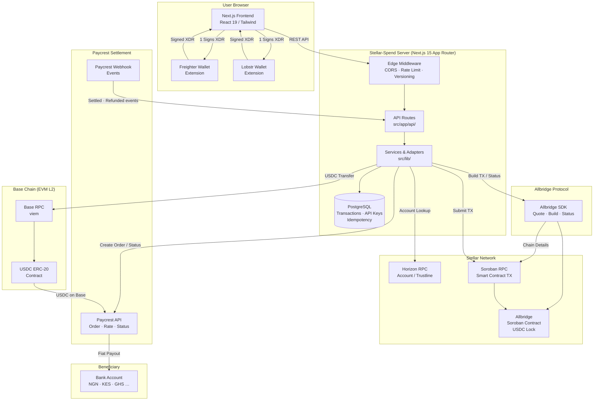
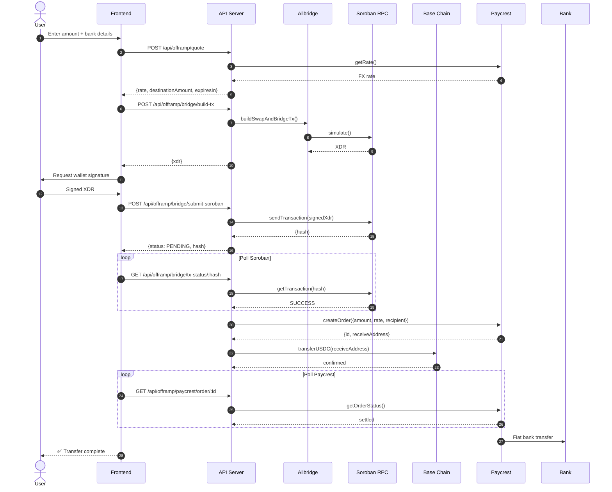
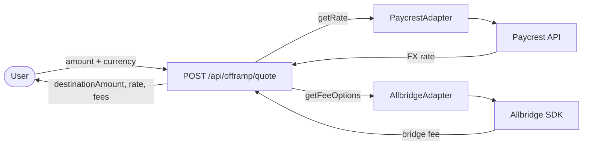
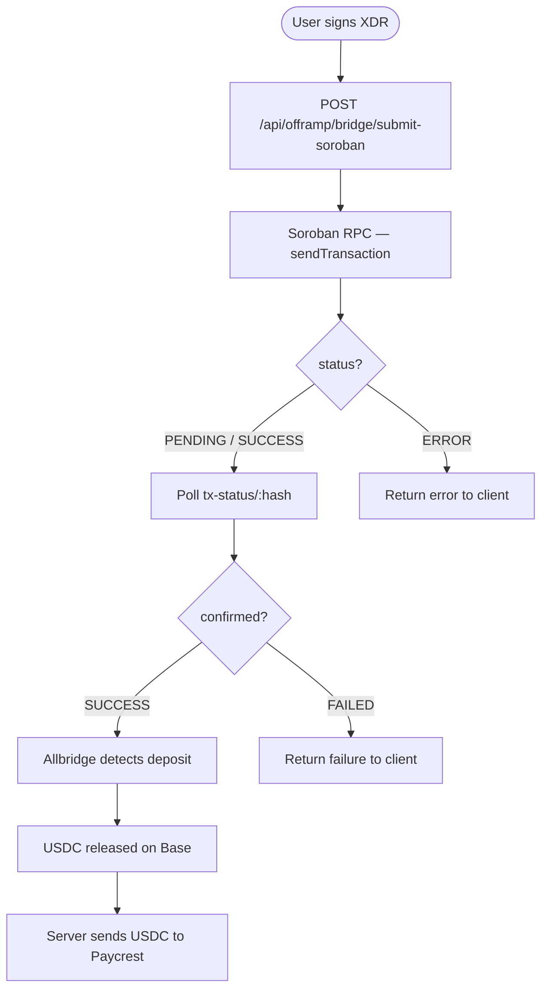
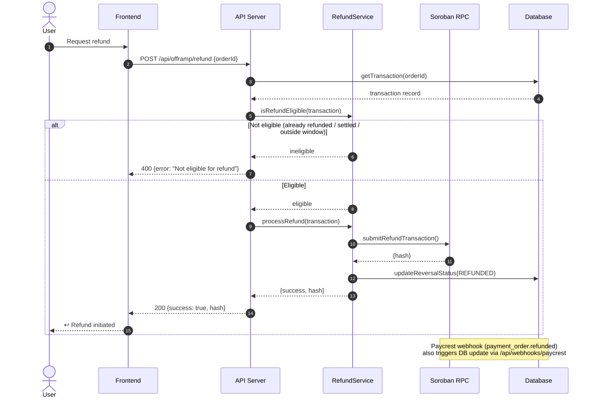
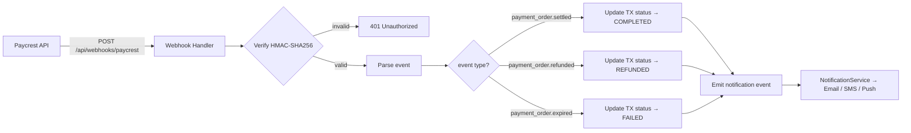

# Architecture Diagrams

All diagrams on this page are the **single source of truth** for the system architecture.
They are checked in CI via `scripts/check-diagrams.sh` — never let them drift from the real code.

> When you change the architecture (new service, new external dependency, new data flow),
> update the relevant diagram below and run `bash scripts/check-diagrams.sh` locally to verify.

---

## System Overview

Shows every major component and how they connect.



---

## Off-Ramp Data Flow

End-to-end sequence for a user converting Stellar USDC to fiat.



---

## Quote Flow



---

## Bridge Flow



---

## Payout Flow

```mermaid
flowchart TD
    A[POST /api/offramp/paycrest/order] --> B{Idempotency check}
    B -->|replayed| C[Return cached response]
    B -->|new| D[Validate request]
    D --> E[PaycrestAdapter.createOrder]
    E --> F[Paycrest API]
    F --> G[{id, receiveAddress}]
    G --> H[BaseClient.transferUSDC to receiveAddress]
    H --> I[Base chain confirmed]
    I --> J[Poll /paycrest/order/:id]
    J --> K{status?}
    K -->|settled| L[✅ Fiat delivered]
    K -->|refunded| M[↩️ USDC returned]
    K -->|expired| N[⏱️ No deposit received]
```

---

## Refund Flow



---

## Webhook Event Flow


