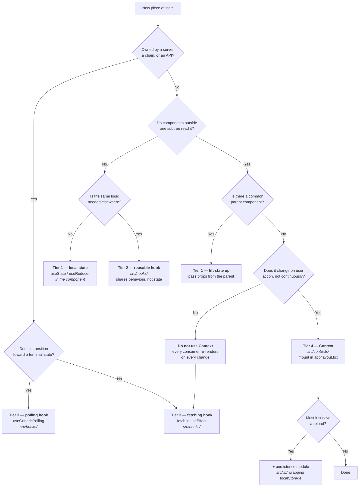

# Frontend State Management

`src/contexts/` and `src/hooks/` currently mix several approaches to shared state with no recorded convention, so it is not obvious whether a new piece of state belongs in a Context, a hook, a storage module, or a component. This guide records the convention.

**The short version:** default to local component state. Reach for a Context only when state is genuinely global, shared by distant components, and changes rarely. There are exactly three Contexts today and that number should grow slowly.

---

## Contents

- [What we do and do not use](#what-we-do-and-do-not-use)
- [The four tiers of state](#the-four-tiers-of-state)
- [Decision tree](#decision-tree)
- [Context inventory](#context-inventory)
- [Rules](#rules)
- [Known inconsistencies](#known-inconsistencies)

---

## What we do and do not use

There is **no global state library** in this project — no Redux, Zustand, Jotai, or MobX — and **no server-state cache** — no TanStack Query, SWR, or Apollo cache. Check `package.json` before assuming otherwise; several patterns below exist because these libraries are absent.

What we use instead:

| Concern | Mechanism |
|---|---|
| Global client state | React Context, in `src/contexts/` (and `src/lib/i18n/provider.tsx`) |
| Server state | `fetch` inside a hook, or `usePollingManager` for status polling |
| Cross-session persistence | `localStorage`, wrapped in a module under `src/lib/` |
| Local state | `useState` / `useReducer` in the component |

Because there is no query cache, **two components calling the same data hook each perform their own request and hold their own copy.** That is the central constraint behind the guidance in this document.

---

## The four tiers of state

Classify state before deciding where to put it. Most misplacements come from skipping this step.

### Tier 1 — Local state

State that only one component and its immediate children care about. Form inputs, open/closed toggles, hover state, the current step of a wizard.

**Use `useState` / `useReducer` directly in the component.** Do not extract a hook merely because the component is getting long, and never lift this into a Context.

### Tier 2 — Reusable local behaviour

Local state whose *logic* repeats across components: clipboard status, focus trapping, undo stacks, keyboard shortcuts.

**Extract a hook into `src/hooks/`.** Each caller still gets its own independent instance — the hook shares *behaviour*, not *state*. `useClipboard`, `useFocusTrap`, `useUndo`, `useKeyboardNavigation`, and `useProgressiveDisclosure` are all this tier.

> The most common mistake in this codebase is assuming a hook shares state. It does not. Two components calling `useNotificationCenter` have two separate notification lists that happen to read the same `localStorage` key.

### Tier 3 — Server state

Anything owned by a backend or a chain: FX rates, balances, quotes, order status, feature flags. It is not really "state" so much as a cached copy of someone else's data, and it can go stale.

**Use a hook that fetches, in `src/hooks/`.** Two patterns exist:

- **One-shot / on-demand fetch** — `fetch` in a `useEffect`, exposing `{ data, loading, error }`. See `useFxRate`, `useStellarBalances`, `useFeatureFlag`.
- **Status polling** — for anything that transitions toward a terminal state (bridge transfers, payout orders). Use `useGenericPolling`, which wraps `usePollingManager` from `src/lib/polling/polling-manager` and handles backoff, terminal states, abort, and consecutive-error limits. See `usePollBridgeStatus`, `usePollPayoutStatus`. **Do not hand-roll a `setInterval` poller.**

Server state does **not** belong in a Context. Putting it there re-renders every consumer on every refresh and makes the staleness window global. If several distant components need the same server data, either lift the fetch to a common parent and pass it down, or accept the duplicate request — it is usually cheaper than the coupling.

### Tier 4 — Global client state

State that is genuinely application-wide, owned by the client rather than a server, and read by components with no ancestor relationship. Theme, locale, toasts.

**Use a Context in `src/contexts/`, mounted in `src/app/layout.tsx`.**

This tier is deliberately small. Three qualifiers must *all* hold:

1. **Genuinely global** — needed across unrelated routes, not just deep in one subtree. If a shared parent exists, pass props.
2. **Client-owned** — not a copy of server data (that is Tier 3).
3. **Low-frequency** — changes on user action, not continuously. Every consumer re-renders on every change, so a Context holding fast-changing state is a performance problem across the whole tree.

If a candidate fails any one of these, it belongs in Tier 1–3.

---

## Decision tree



---

## Context inventory

Three providers exist. All three are mounted in `src/app/layout.tsx`, in this order:

```
I18nProvider
  └── ThemeProvider
        └── ToastProvider
              └── {children}
```

### `I18nProvider` — `src/lib/i18n/provider.tsx`

| | |
|---|---|
| **Owns** | Active `language`, the `I18n` instance, `isRTL` |
| **Consumed via** | `useI18n()` / `t()` |
| **Persistence** | `localStorage["stellar_language"]` |
| **Why Context** | Every rendered string depends on it; changes only on explicit user action |
| **Note** | Lives in `src/lib/i18n/`, not `src/contexts/`, because it ships with the rest of the i18n module. Outermost provider, since `HtmlDirSync` sets document direction from it. |

Supported languages: `en`, `es`, `fr`, `zh`, `ar`, `pt`, `sw`. Falls back to browser detection, then `en`.

### `ThemeProvider` — `src/contexts/ThemeContext.tsx`

| | |
|---|---|
| **Owns** | Active `theme` (`light` \| `dark` \| `high-contrast`), `isSystem` |
| **Consumed via** | `useTheme()` — **from `@/contexts/ThemeContext`**, see [Known inconsistencies](#known-inconsistencies) |
| **Persistence** | `localStorage["theme"]`; absent key means "follow system" |
| **Why Context** | Applied as `data-theme` on `<html>`, read by components anywhere, changes only on user action or an OS preference change |
| **Note** | Tracks `prefers-color-scheme` and `prefers-contrast` while `isSystem` is true. Emits a `theme_change` accessibility beacon to `/api/monitoring/vitals` on every applied change. A blocking `themeInitScript` in `<head>` sets the initial attribute to avoid a flash before hydration. |

### `ToastProvider` — `src/contexts/ToastContext.tsx`

| | |
|---|---|
| **Owns** | The active `toasts` array |
| **Consumed via** | `useToasts()` (read), `useToastActions()` (write), `useToast()` (both) |
| **Persistence** | None — intentionally ephemeral |
| **Why Context** | Any component must be able to raise a toast without prop-drilling a callback |
| **Note** | **Split into two Contexts on purpose**: state and actions are separate providers so components that only *raise* toasts do not re-render when the toast list changes. Toasts auto-dismiss after 5s. |

> The Toast split is the pattern to copy for any new Context whose actions are stable but whose state changes often. Prefer `useToastActions()` over `useToast()` when you only need to raise a toast.

### Not Contexts, despite being app-wide

These are shared through a module rather than a provider — deliberately, since they are read imperatively rather than rendered:

| Concern | Where |
|---|---|
| Wallet connection | `src/lib/wallets/manager.ts`, surfaced by `useStellarWallet` |
| Transaction history | `localStorage` via `src/lib/` storage modules (see [ADR-001](./adr/ADR-001-localstorage-transaction-history.md)) |
| Sync settings | `src/lib/sync-storage.ts`, surfaced by `useSyncSettings` |
| Price alerts / notifications | `src/lib/price-alerts.ts`, surfaced by `useNotificationCenter` |
| Feature flags | fetched per-consumer by `useFeatureFlag` |

---

## Rules

1. **Default to local.** Start at Tier 1. Promote only when a concrete second consumer exists — not in anticipation of one.
2. **A new Context needs all three Tier-4 qualifiers.** Global, client-owned, low-frequency. Adding one means editing `src/app/layout.tsx`, which affects every route — say why in the PR description.
3. **Never put server state in a Context.** Use a Tier-3 hook.
4. **Split state from actions** in any Context whose state changes more often than its action identities, as `ToastContext` does.
5. **One owner per piece of state.** Exactly one hook or Context is the source of truth for a given concern. Do not add a second implementation because the first is awkward to import — fix the first.
6. **Persist through a module, not inline.** Wrap `localStorage` in a module under `src/lib/` (as `SyncStorage` and `PriceAlertStorage` do) rather than calling it from a component. Keeps SSR guards and key names in one place.
7. **Guard every browser API.** Providers and hooks run during SSR. Check `typeof window === "undefined"` before touching `window`, `localStorage`, or `navigator`, and do initial reads in `useEffect` so the server and first client render agree.
8. **Mark client files.** Every Context and any hook touching browser APIs needs `"use client"` at the top.
9. **Contexts throw when unmounted.** Follow the existing pattern — a `useX` that throws a named error outside its provider, rather than returning `null` or a silent default.

---

## Known inconsistencies

Current deviations from the convention above, recorded so they are not copied.

### Two independent theme implementations

`src/contexts/ThemeContext.tsx` and `src/hooks/useTheme.ts` both export a hook named `useTheme`, and both write `localStorage["theme"]`. They share no state.

They are imported in different places:

| File | Imports from | Theme values |
|---|---|---|
| `src/components/ThemeToggle.tsx` | `@/contexts/ThemeContext` | `light`, `dark`, `high-contrast` |
| `src/app/settings/page.tsx` | `@/hooks/useTheme` | `light`, `dark`, `system` |

The value sets are incompatible, which produces three observable problems:

- The settings page writes `"system"`, which `ThemeContext`'s validator rejects. The context reads it back as "no stored preference" — coincidentally close to the intended behaviour, but by accident, not design.
- The settings page cannot select `high-contrast` at all, even though the context supports it and applies it for users with `prefers-contrast: more`.
- Changing the theme in settings does not update `ThemeToggle`, since neither implementation observes the other. The toggle shows a stale value until it remounts. Theme changes made from settings also skip the accessibility analytics beacon.

**`@/contexts/ThemeContext` is the source of truth.** New code must import from there. `src/hooks/useTheme.ts` should be deleted and `src/app/settings/page.tsx` migrated to the context — the settings UI needs a `high-contrast` option and should use `useSystemTheme()` for its "system" button.

### Wallet state is duplicated per consumer

`useStellarWallet` holds connection state in `useState` and is called independently by `src/app/page.tsx`, `src/app/history/page.tsx`, `src/components/WalletBalanceDisplay.tsx`, `src/components/PriceAlertManager.tsx`, and `src/components/StellarSpendDashboard.tsx`.

Each call site therefore runs its own auto-reconnect effect, registers its own wallet event listeners, and keeps its own `isConnected` / `publicKey` / `error`. They coordinate only through `localStorage` and the shared `WalletManager`, so nothing guarantees they agree within a render — one component can show "connected" while another still shows "connecting", and a disconnect in one is invisible to the others until they re-read.

Wallet connection satisfies all three Tier-4 qualifiers — global, client-owned, and changing only on user action — so **this is the clearest candidate for a new Context.** Consolidating it into a `WalletProvider` would collapse five reconnect effects into one. Until that happens, prefer receiving wallet state as props over adding a sixth `useStellarWallet` call site.

### Server state is refetched per consumer

With no query cache, hooks like `useFxRate` (3 call sites) and `useStellarBalances` issue one request per consumer, with no deduplication and no shared staleness. This is a consequence of the "no server-state library" decision rather than a mistake, and it is tolerable at the current number of call sites.

The fix is a query cache, not a Context — see [Rules](#rules) §3. If the duplication becomes a real cost, that is a dependency decision worth an ADR.

### `useFeatureFlag` has no consumers

`src/hooks/useFeatureFlag.ts` is not imported anywhere in `src/`. It fetches `/api/admin/feature-flags` per consumer with no caching, so if it is adopted, it should follow the Tier-3 guidance above rather than being promoted to a Context. See [ADR-011](./adr/ADR-011-feature-flag-approach.md) for the flag system itself.

---

## See also

- [ADR-001](./adr/ADR-001-localstorage-transaction-history.md) — why transaction history lives in `localStorage`
- [ADR-010](./adr/ADR-010-realtime-transport-sse-vs-websocket.md) — real-time transport, which feeds Tier-3 state
- [ADR-011](./adr/ADR-011-feature-flag-approach.md) — feature flags
- [`docs/code-organization.md`](./code-organization.md) — where files live
- [`docs/accessibility.md`](./accessibility.md) — theme and contrast requirements
